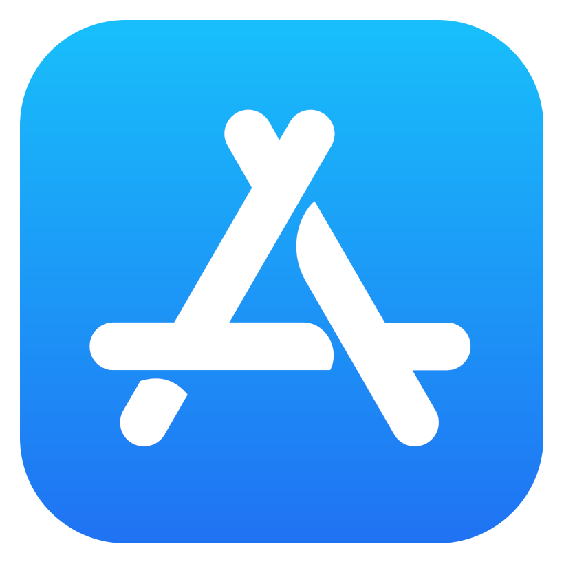

# Hi 👋 My name is Hernan

## Full-Stack Mobile Developer

<div>
  <a href="https://hernan-hawryluk.vercel.app"></a>
  <a href="https://github.com/hernanhawryluk/hernanhawryluk/blob/main/README.es.md"></a>
  <a href="#"></a>
</div>
<br>

Full Stack Developer specialized in mobile applications with strong experience in React Native for cross-platform development, Swift with SwiftUI for native iOS apps, and Kotlin with Jetpack Compose for Android. I have a solid background in building high-quality, scalable, and stable solutions, always aiming to deliver excellent user experiences. I actively participate in the full development cycle, including client interaction, requirement gathering, project planning, development, deployment, and ongoing production support.

I have led development teams, promoting effective collaboration, organized workflows, and the achievement of project goals in a timely and efficient manner. I am well-versed in Agile and Scrum methodologies, and I consistently apply best practices in development, code optimization, and CI/CD processes to ensure continuous improvement and reliable delivery. I am passionate about working on challenging projects where I can provide real value, solve meaningful problems, and continue growing as a developer and as a leader.

- 🌍 I'm based in Argentina, Buenos Aires, Monte Grande.
- 🖥️ See my [portfolio](https://hernan-hawryluk.vercel.app/) developed in Next.js and deployed on Vercel.
- 🚀 Currently working as a Mobile Developer.
- ✉️ You can contact me at [LinkedIn](https://www.linkedin.com/in/hernan-hawryluk).
  <br>

## My Skill Set

<table style="border-style=dotted;">
  <tr>
    <td valign="top" align="center" width="33%">
      <h2>Front-end</h2>
        <a href="https://developer.mozilla.org/en-US/docs/Glossary/HTML5" target="_blank"></a>
        <a href="https://www.w3.org/TR/CSS/#css" target="_blank"></a>
        <a href="https://www.javascript.com/" target="_blank"></a>
        <a href="https://www.typescriptlang.org/" target="_blank"></a>
        <a href="https://developer.apple.com/swift" target="_blank"></a>
        <a href="https://developer.apple.com/xcode/swiftui/" target="_blank"></a>
        <a href="https://kotlinlang.org/" target="_blank"></a>
        <a href="https://reactjs.org/" target="_blank"></a>
        <a href="https://expo.dev/" target="_blank"></a>
        <a href="https://nextjs.org/" target="_blank"></a>
        <a href="https://www.tailwindcss.com/" target="_blank"></a>  
        <a href="https://getbootstrap.com/" target="_blank"></a>
    </td>
    <td valign="top" align="center" width="33%">
      <h2>Back-end</h2> 
        <a href="https://www.python.org/" target="_blank"></a>  
        <a href="https://www.djangoproject.com/" target="_blank"></a>
        <a href="https://www.javascript.com/" target="_blank"></a>  
        <a href="https://www.typescriptlang.org/" target="_blank"></a>
        <a href="https://nextjs.org/" target="_blank"></a>  
        <a href="https://nodejs.org/en/" target="_blank"></a>
        <a href="https://expressjs.com/" target="_blank"></a>
        <a href="https://www.java.com/" target="_blank"></a>
        <a href="https://spring.io/projects/spring-boot" target="_blank"></a>
    </td>
    <td valign="top" align="center" width="33%">
      <h2>DB & Cloud</h2>
        <a href="https://www.mysql.com/" target="_blank"></a>
        <a href="https://www.postgresql.org/" target="_blank"></a>  
        <a href="https://www.prisma.io/" target="_blank"></a>  
        <a href="https://www.mongodb.com/" target="_blank"></a>
        <a href="https://firebase.google.com/" target="_blank"></a>
        <a href="https://www.gnu.org/software/bash/" target="_blank"></a>
        <a href="https://cloud.google.com/" target="_blank"></a>
        <a href="https://play.google.com/store" target="_blank"></a>
        <a href="https://www.apple.com/app-store/" target="_blank"></a>
        <a href="https://aws.amazon.com/" target="_blank"></a>
    </td>
  </tr>
</table>
<br>

## 💻 Representing myself as an instance of a class in Python

```python
class FullStackDeveloper:
    def __init__(self, fullname, role, workplace):
        self.fullname = fullname
        self.role = role
        self.workplace = workplace
        self.languages = {"Spanish", "English"}
        self.coding_languages = {"JavaScript", "TypeScript", "Swift", "Kotlin", "Python", "Java"}
        self.technologies = {
            "front_end": {
                "basics": ["HTML", "CSS", "JavaScript"],
                "web": ["React", "Next.js", "Tailwind CSS", "Bootstrap"],
                "mobile": ["React Native", "Swift", "SwiftUI", "Kotlin", "Jetpack Compose"],
            },
            "back_end": {
                "typescript": ["Node.js", "Express", "Next.js"],
                "python": ["Django", "Django REST Framework"],
                "java": ["Spring Boot"],
            },
            "databases": {
                "sql": ["MySQL", "PostgreSQL", "SQLite"],
                "no_sql": ["MongoDB", "Firebase"],
            },
            "dev_ops": {
                "hosting": ["AWS", "Vercel"],
                "publishing": ["Google Play Store", "Apple App Store"],
            },
        }

    def work(self, tech_type, tech_category, tech_name):
        try:
            if tech_name in self.technologies[tech_type][tech_category]:
                return f"Actualmente estoy trabajando en desarrollo de {tech_category} utilizando {tech_name}."
            else:
                return f"{tech_name} no forma parte de mi stack de {tech_category}. Estoy abierto a aprenderlo."
        except KeyError:
            return f"'{tech_category}' no es una categoría válida dentro de '{tech_type}'."

    def __str__(self):
        return f"¡Hola! Mi nombre es {self.fullname}, y soy {self.role} en {self.workplace}."

    def __repr__(self):
        return f"FullStackDeveloper(fullname='{self.fullname}', role='{self.role}', workplace='{self.workplace}')"

hernan_hawryluk = FullStackDeveloper("Hernan Hawryluk", "Mobile Developer", "Bytewave")
work = hernan_hawryluk.work("front_end", "mobile", "React Native")

print(hernan_hawryluk)
print(work)
```

<br>

## Snake eating contribution graph

<div align="center">
  <picture>
    <source media="(prefers-color-scheme: dark)" srcset="https://raw.githubusercontent.com/hernanhawryluk/hernanhawryluk/output/github-contribution-grid-snake-dark.svg">
    <source media="(prefers-color-scheme: light)" srcset="https://raw.githubusercontent.com/hernanhawryluk/hernanhawryluk/output/github-contribution-grid-snake.svg">
    
  </picture>
</div>

<br>

## Connect with me

<div>
  <a href="https://github.com/hernanhawryluk" target="_blank">
  
  </a>
  <a href="https://linkedin.com/in/hernan-hawryluk" target="_blank">
  
  </a>
  <a href="https://www.youtube.com/channel/UCPfXI175l66910dP1rMkD2w" target="_blank">
  
  </a> 
  <a href="https://hernan-hawryluk.vercel.app" target="_blank">
  
  </a> 
</div>
